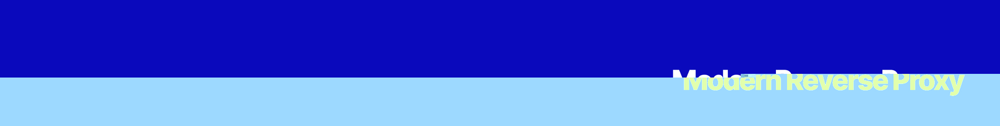

<p align="center"></p>

[![npm version][npm-version-src]][npm-version-href]
[![GitHub Actions][github-actions-src]][github-actions-href]
[](http://commitizen.github.io/cz-cli/)
<!-- [![npm downloads][npm-downloads-src]][npm-downloads-href] -->
<!-- [![Codecov][codecov-src]][codecov-href] -->

# A Better Developer Experience

> A reverse proxy for local development with SSL support, custom domains, and more, including a zero-config setup.

## Features

- Reverse Proxy
- SSL Support
- Custom Domains
- Auto HTTP to HTTPS Redirection
- `/etc/hosts` Management
- Dependency-free Binary
- Zero-config Setup

## Install

```bash
bun install -d bun-reverse-proxy
```

_Alternatively, you can install:_

```bash
brew install reverse-proxy # wip
pkgx install reverse-proxy # wip
```

## Usage

Given you installed the npm package, you can use it in your project:

```js
import { startProxy } from 'bun-reverse-proxy'

startProxy({
  from: 'localhost:3000',
  to: 'my-project.localhost' // or try 'my-project.test'
})
```

### CLI

```bash
reverse-proxy --from localhost:3000 --to my-project.localhost
reverse-proxy --from localhost:3000 --to my-project.test --keyPath ./key.pem --certPath ./cert.pem
reverse-proxy --help
reverse-proxy --version
```

### Configuration

You can also use a configuration file:

```ts
export default {
  'localhost:3000': 'stacks.localhost'
}
```

_Then run:_

```bash
reverse-proxy start
```

Your config will be loaded from `reverse-proxy.config.ts` _(or `reverse-proxy.config.js`)_.
Learn more in the docs.

## Testing

```bash
bun test
```

## Changelog

Please see our [releases](https://github.com/stacksjs/stacks/releases) page for more information on what has changed recently.

## Contributing

Please review the [Contributing Guide](https://github.com/stacksjs/contributing) for details.

## Community

For help, discussion about best practices, or any other conversation that would benefit from being searchable:

[Discussions on GitHub](https://github.com/stacksjs/stacks/discussions)

For casual chit-chat with others using this package:

[Join the Stacks Discord Server](https://discord.gg/stacksjs)

## Postcardware

Two things are true: Stacks OSS will always stay open-source, and we do/would love to receive postcards from wherever Stacks is used! 🌍 _And we also publish them on our website. -Thank you, Spatie_

Our address: Stacks.js, 5710 Crescent Park #107, Playa Vista 90094, CA.

## License

The MIT License (MIT). Please see [LICENSE](https://github.com/stacksjs/stacks/tree/main/LICENSE.md) for more information.

Made with 💙

<!-- Badges -->
[npm-version-src]: https://img.shields.io/npm/v/bun-reverse-proxy?style=flat-square
[npm-version-href]: https://npmjs.com/package/bun-reverse-proxy
[github-actions-src]: https://img.shields.io/github/actions/workflow/status/stacksjs/reverse-proxy/ci.yml?style=flat-square&branch=main
[github-actions-href]: https://github.com/stacksjs/reverse-proxy/actions?query=workflow%3Aci

<!-- [codecov-src]: https://img.shields.io/codecov/c/gh/stacksjs/reverse-proxy/main?style=flat-square
[codecov-href]: https://codecov.io/gh/stacksjs/reverse-proxy -->
